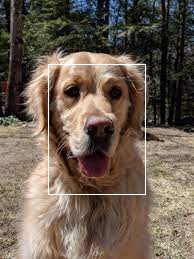
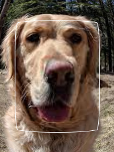
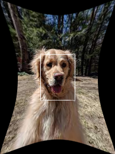
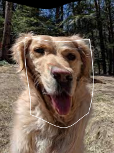

# torch-tps

[](https://github.com/raphaelreme/torch-tps/actions/workflows/tests.yml)

PyTorch implementation of the generalized Polyharmonic Spline interpolation (also known as Thin Plate Spline in 2D). It learns a smooth elastic mapping between two Euclidean spaces with support for:

- Arbitrary input and output dimensions
- Arbitrary spline order `k`
- Optional regularization
- Supports CPU and GPU parallelization

Useful for interpolation, deformation fields, and smooth non-linear regression.

For a NumPy implementation, see [tps](https://github.com/raphaelreme/tps).

This implementation is much faster than the NumPy one, thanks to the cpu //. Using gpu seems not to be much faster for fitting (linear system solving), but is much faster to transform (as this is simply a matrix multiplication).

## 🚀 Install

### Pip

```bash
$ pip install torch-tps
```

## Getting started


## Getting started

```python
import torch
from torch_tps import ThinPlateSpline

# Control points
X_train = torch.random.normal(0, 1, (800, 3))  # 800 points in R^3
Y_train = torch.random.normal(0, 1, (800, 2))  # Values for each point (800 values in R^2)

# New source points to interpolate
X_test = torch.random.normal(0, 1, (3000, 3))

# Initialize spline model (Regularization is controled with alpha parameter)
tps = ThinPlateSpline(alpha=0.5)  # Use device="cuda" to switch to gpu

# Fit spline from control points
tps.fit(X_train, Y_train)

# Interpolate new points
Y_test = tps.transform(X_test)
```

## Examples

See the `example/` folder for scripts showing:

- Interpolation in 1D, 2D, 3D
- Arbitrary input and output dimensions
- Image warping with elastic deformation

### Image Warping

Example of increasing/decreasing/randomly deforming a dog's face using sparse control points.






Code: `example/image_warping.py`


## 🧠 Theory Summary

The model solves the regularized interpolation problem:

$$
min_f \sum_{i=1}^n (y_i - f(x_i))^2 +  \int \|\nabla^{\text{order}} f\|_2^2 dx
$$

With solution:

$$
f(x) = P(x) +  \sum_{i=1}^n w_i G(\|x - x_i\|_2)
$$

Where:

- G(r): radial basis function (RBF) (depends on `order` and the input dimension `d`)
- P(x): a polynomial of degree `order - 1`

Default kernel (TPS):
$$G(r) = r^2 \log(r)$$

General kernel:
$$
\begin{aligned} &G(r) = r^{(2 \text{order} - d)} & \text{ if d is odd}\\ &G(r) = r^{(2\text{order} - d)} \log(r) & \text{ otherwise}\end{aligned}
$$


## 🔧 API

### `ThinPlateSpline(alpha=0.0, order=2, enforce_tps_kernel=False, device="cpu")`

Creates a general polyharmonic spline interpolator (Default to TPS in 2D and natural cubic splines in 1D).

- **alpha** *(float)*: Regularization strength (default 0.0)
- **order** *(int)*: Spline order (default is 2 for TPS)
- **enforce_tps_kernel** *(bool)*: Force TPS kernel r^2 log r, even when mathematically suboptimal
- **device** *(torch.device)*: Use "cuda" to enable gpu computations. Default to "cpu".

### `.fit(X, Y)`

Fits the model to control point pairs.

- **X**: `(n, d)` input coordinates
- **Y**: `(n, v)` target coordinates

Returns: `self`

### `.transform(X)`

Applies the learned mapping to new input points.

- **X**: `(n', d)` points

Returns: `(n', v)` interpolated values

## Development

```bash
git clone https://github.com/raphaelreme/tps.git
cd tps
pip install -e .
```

## License

MIT License
